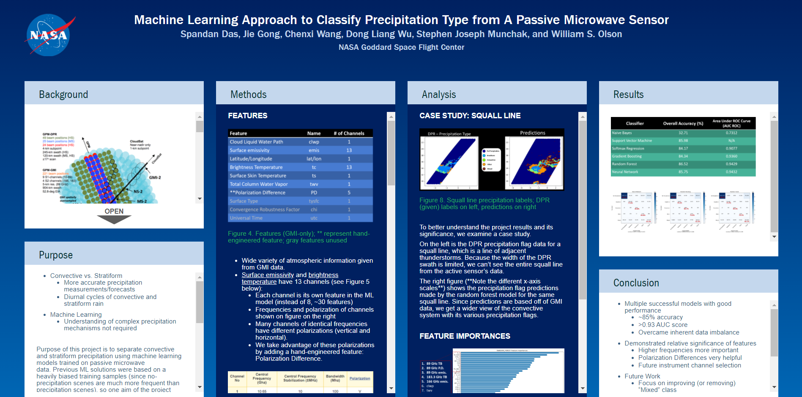

# NASA_Internship_2020

## Machine Learning for Precipitation Classification using Synthesized Passive Microwave Data
### Abstract
Precipitation flag (precipitating or not; stratiform or convective) is a key parameter used for better retrieval of precipitation characteristics as well as to understand the cloud-precipitation physical processes. The Global Precipitation Measurement (GPM) Core Observatory's Microwave Imager (GMI) and Dual-Frequency Precipitation Radar (DPR) together provide ample information on global precipitation characteristics. As an active sensor, DPR provides an accurate precipitation flag assignment, while passive sensors like GMI are traditionally believed not to be differentiate between precipitation types. Using collocated precipitation flags from DPR as the “truth”, this project employs machine learning models to train and test the predictability and accuracy of using passive GMI-only observations together with ancillary atmosphere information from reanalysis. The satellite data used spans the course of a year, reducing the model’s potential bias towards any season. Precipitation types are classified into the following classes: convective, stratiform, convective-stratiform mixture, no precipitation, and other precipitation. To overcome the inherent imbalance among the precipitation categories, a simple dynamic sub-sampling technique is employed. A variety of classification algorithms are tested, including Support Vector Machines, Naive Bayes, Random Forests, Gradient Boosting, and Neural Networks (Multilayer Perceptron Network), and their results are evaluated and compared. The highest-performing trained models (Neural Network, Random Forest, and Gradient Boosting) have around 85% prediction accuracy for every type of precipitation when tested on holdout data. High-frequency channels (166 GHz and 183 GHz channels) and 166 GHz polarization difference are found among the most important factors that contribute to the model performance, which shed light on future instrument channel selection.

 

* DPR: Dual-Frequency (Ku-Ka band) Precipitation Radar
* GMI: Multi-Channel (10-183 GHz) GPM Microwave Imager

GPM Core Observatory       |  Scan Details
:-------------------------:|:-------------------------:
  |  

## Presentation at American Geophysical Union 2020 Fall Meeting

[View Digital Poster](https://agu2020fallmeeting-agu.ipostersessions.com/default.aspx?s=05-CC-B0-2F-B8-AE-91-F0-BC-BF-9A-EB-92-9E-BB-FE)

## Sources 
* G. Skofronick Jackson, 2nd NOAA User Workshop on the GPM Mission, Nov 29, 2011, College Park, MD (https://www.star.nesdis.noaa.gov/star/documents/meetings/GPM2011/dayOne/Skofronick-JacksonG.pdf)
* MiRS Sensors GPM GMI Overview (https://www.star.nesdis.noaa.gov/mirs/gpmgmi.php)
* NOAA GPM Users Workshop, April 2-3, 2013 (https://www.star.nesdis.noaa.gov/star/documents/meetings/GPM2013/dayOne/Skofronick-Jackson.pdf)
