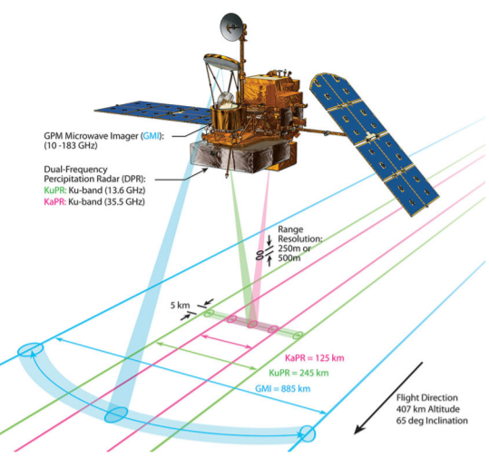
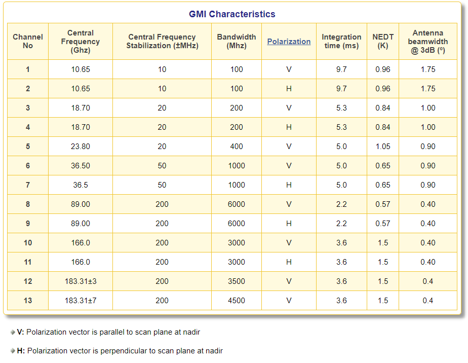

# NASA_Internship_2020

## Project
Machine Learning for Precipitation Classification using Synthesized Passive Microwave Data

* DPR: Dual-Frequency (Ku-Ka band) Precipitation Radar
* GMI: Multi-Channel (10-183 GHz) GPM Microwave Imager
* Combined Radar-Radiometer Retrieval

GPM Core Observatory       |  Scan Details
:-------------------------:|:-------------------------:
  |  

## Sources 
* G. Skofronick Jackson, 2nd NOAA User Workshop on the GPM Mission, Nov 29, 2011, College Park, MD (https://www.star.nesdis.noaa.gov/star/documents/meetings/GPM2011/dayOne/Skofronick-JacksonG.pdf)
* https://www.star.nesdis.noaa.gov/mirs/gpmgmi.php
